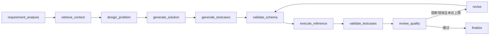

# Programming Training Project 2 — Online Judge

程序设计训练大作业二的 Online Judge 项目。本仓库目前提供可运行的 FastAPI 后端、Streamlit 前端和测试基础设施；公共异步数据层、用户认证、课程 Step 1 题目管理、Step 2 语言注册和评测引擎、Step 2/3 Submission 生命周期，以及 Step 4/5 用户权限、评测日志与访问审计已经实现。前端管理页面与 AI 命题功能仍留待后续阶段。

## 环境要求

- Python 3.10 或更高版本；课程目标解释器版本为 Python 3.10
- C++ 需要 GCC 9+，统一使用 `-std=c++14` 编译
- 最终评测环境为 Linux；Windows 用户强烈建议在 WSL 中运行评测服务

## 安装

```bash
python -m venv .venv
```

激活虚拟环境后安装开发依赖：

```bash
python -m pip install -r requirements-dev.txt
```

如需覆盖默认配置，将 `.env.example` 复制为 `.env` 后修改。不要提交 `.env` 或任何密钥。

默认 SQLite 数据库位于 `data/runtime/oj.sqlite3`，启动时自动创建数据表、内置 Python/C++ 语言和初始管理员（用户名 `admin`，密码 `admintestpassword`）。数据库文件和 `.env` 均已被 Git 忽略。可通过 `OJ_DATABASE_PATH` 修改数据库位置，通过 `OJ_PROBLEMS_PATH` 修改题目目录，通过 `OJ_SESSION_MAX_AGE_SECONDS` 修改 Session 有效期；生产 HTTPS 环境应设置 `OJ_SESSION_COOKIE_SECURE=true`。

## 启动

启动后端：

```bash
python -m uvicorn backend.app.main:app --reload
```

API 健康检查位于 <http://localhost:8000/api/health>，交互文档位于 <http://localhost:8000/docs>。课程用户接口为：

- `POST /api/users/`：注册普通用户。
- `POST /api/auth/login`、`POST /api/auth/logout`：登录和登出。
- `GET /api/users/{user_id}`：本人或管理员查询用户信息和统计。
- `GET /api/users/`：管理员分页查询用户列表。
- `POST /api/users/admin`：管理员创建管理员。
- `PUT /api/users/{user_id}/role`：管理员设置 `user`、`admin` 或 `banned`。

旧的 `/api/users/register|login|logout|me` 路径保留为兼容别名；新代码应使用课程 API 路径。

用户名长度为 3–40 个字符，密码至少 6 位。接口响应不会返回密码、密码哈希或 Session ID。

## 用户角色与权限

| 操作 | 未登录 | user | admin | banned |
| --- | --- | --- | --- | --- |
| 查看题目、创建/编辑题目、创建语言、提交 | 401 | 允许 | 允许 | Session 作废 |
| 查看用户信息 | 401 | 仅本人 | 任意用户 | 不允许 |
| 用户列表、修改角色 | 401 | 403 | 允许 | 不允许 |
| 删除题目、重新评测 | 401 | 403 | 允许 | 不允许 |
| Submission 详情 | 401 | 仅本人 | 任意提交 | 不允许 |
| 私有评测日志 | 401 | 仅本人 | 任意日志 | 不允许 |

用户变为 `banned` 时，其全部数据库 Session 会立即删除，之后登录返回 403。系统禁止将最后一个有效管理员降级或封禁，避免不可恢复的权限状态。`submit_count` 直接统计该用户持久化 Submission 总数；`resolve_count` 只统计 `status=success` 且最终结果为 `AC` 的不同 `problem_id`，因此同题多次 AC 只算一次，WA、pending 和 error 均不计入。

课程 Step 1 题目接口如下，均使用统一的 `{code, msg, data}` 响应结构：

- `GET /api/problems/`：登录用户查看按题号稳定排序的题目摘要列表。
- `GET /api/problems/{problem_id}`：登录用户查看完整题目配置。
- `POST /api/problems/`：登录用户新增完整题目。
- `PUT /api/problems/{problem_id}`：登录用户完整替换题目配置。
- `DELETE /api/problems/{problem_id}`：管理员删除题目。

课程 Step 2 语言接口：

- `GET /api/languages/`：查询当前启用的语言名称列表。
- `POST /api/languages/`：登录用户注册语言；请求字段严格遵循课程 API 的 `name`、`file_ext`、`compile_cmd`、`run_cmd`、`time_limit` 和 `memory_limit`。

命令模板仅允许 `{src}`、`{exe}` 占位符。系统会用 `shlex` 将 API 中的字符串模板转换为参数数组，拒绝管道、重定向、命令连接符、变量展开和未知占位符；执行始终使用 `asyncio.create_subprocess_exec`，不会启用 shell。语言配置持久化在公共异步 SQLite 数据层中，名称全局唯一。

## 个人题库

登录后可从“题目 → 我的题库”创建多个私有题库，并修改名称、描述或删除题库。
名称去除首尾空白后为 1–40 字符，同一用户不可重名；描述可空，最多 200 字符。
题库按创建时间倒序显示，题目按题号排序，支持关键词搜索、难度筛选、分页及点击题目
进入已有详情和提交页面；从详情可返回原题库。

普通题目列表和题库主页仅供浏览。点击题库名称进入主页，描述单独显示在“题库描述”
面板中，底部提供编辑和删除入口。“我的题库”列表底部的“创建题库”进入独立创建页；
创建和编辑页的“＋ 增加题目”进入独立筛选选题页，支持单选、批量选择和全选当前页。
翻页、改变筛选或切换题库会清空选择。创建时的名称、描述和已选题目在页面往返时保留，
保存时题库和初始题目在同一事务内创建。编辑页增加、移出和移动题目即时生效，
名称和描述通过“保存名称与描述”保存。删除题库和移出题目均需确认，不删除原题。
所有列表上方统一用“共 N 条”胶囊展示总数，页码仅出现在分页器中。

同题可收录到多个题库，同库重复添加不会产生重复记录。移动以 SQLite 事务完成；
目标题库已有该题时保留一份，任意题目校验失败则整批不执行。题库保存题号引用，
展示原题最新信息；原题删除后保留“题目已删除”条目并计入数量，可移出但不可打开或移动。

以下接口均要求登录，沿用 `{code, msg, data}` 响应。用户身份来自 Session，管理员
也仅能访问自己的题库，访问他人题库返回 404。题库数据不会进入跨用户共享缓存。

| 接口 | 请求与结果 |
| --- | --- |
| `GET /api/problem-banks/` | 本人题库列表，含 `problem_count` |
| `POST /api/problem-banks/` | `name`、可选 `description` 和 `problem_ids`；原子创建并返回 `id` |
| `GET /api/problem-banks/{id}` | 题库信息、数量及 `problems` 摘要，含 `available` 标记 |
| `PUT /api/problem-banks/{id}` | `name`、可选 `description`，完整替换题库元信息 |
| `DELETE /api/problem-banks/{id}` | 删除题库及收录关系 |
| `POST /api/problem-banks/{id}/problems` | `problem_ids` 非空数组，批量添加 |
| `POST /api/problem-banks/{id}/problems/remove` | `problem_ids`，批量移出，不存在的关系按成功处理 |
| `POST /api/problem-banks/{id}/problems/move` | `problem_ids`、`target_bank_id`，批量移动 |

数据库启动时幂等创建 `problem_banks` 和 `problem_bank_items` 及索引，无需手动迁移，
已有用户、题目和提交数据保持不变。题库功能测试：

```bash
python -m pytest tests/test_problem_banks.py tests/test_problem_banks_ui.py
```

## 评测引擎

下一阶段的 Submission 后台任务可直接调用异步接口：

```python
result = await request.app.state.judge_service.judge(
    JudgeRequest(problem_id="P1001", language="python", code=source_code)
)
```

评测器在操作系统临时目录中为每次请求创建独立工作区，编译一次后逐个运行题目的所有测试点，结束时清理源文件、可执行文件和临时数据。每个 AC 测试点计 10 分；单点结果为 `AC`、`WA`、`TLE`、`MLE`、`RE`、`CE` 或 `UNK`。它会限制采集的 stdout/stderr，按 UTF-8 严格解码输出，并且仅忽略每行末尾空格及输出末尾多余换行。

Linux/WSL 下同时通过 `resource.setrlimit` 限制地址空间和 CPU 时间，并由 `psutil` 监控主进程及其递归子进程；超时或超内存时终止整个进程组。Windows 下通过 `psutil` 监控和终止进程树，并使用异步墙钟超时，但没有与 Linux `setrlimit` 完全等价的内核级限制，因此属于开发环境的安全降级。可配置项包括：

- `OJ_JUDGE_COMPILE_TIMEOUT_SECONDS`：编译超时，默认 10 秒。
- `OJ_JUDGE_COMPILE_MEMORY_LIMIT_MB`：编译内存上限，默认 512 MB。
- `OJ_JUDGE_OUTPUT_LIMIT_BYTES`：每条 stdout/stderr 流的最大采集量，默认 64 KiB。
- `OJ_JUDGE_TEMP_ROOT`：可选的临时目录根；必须指向项目源码树之外的受控目录。未设置时使用操作系统临时目录。

该评测器满足课程作业的单用户异步评测、资源限制和多语言要求，但不是面向不可信互联网用户的生产级安全沙箱。它不提供容器/虚拟机隔离、网络隔离、系统调用过滤或多租户防护；不要将其直接暴露给不可信公网流量。

## Submission 生命周期

课程 Step 2/3 接口如下：

- `POST /api/submissions/`：登录用户提交代码并立即获得 `pending` 状态。
- `GET /api/submissions/`：按用户或题目筛选，支持状态与分页；普通用户始终只能看到自己的提交。
- `GET /api/submissions/{submission_id}`：提交者本人或管理员查看总体结果。
- `PUT /api/submissions/{submission_id}/rejudge`：管理员启动重新评测。

Submission 的 `status` 只有 `pending`、`success` 和 `error`。`pending` 表示等待或正在执行；`success` 表示评测流程正常完成，因此用户程序得到 `AC`、`WA`、`CE`、`RE`、`TLE`、`MLE` 或 `UNK` 都属于 `success`；只有评测基础设施、任务数据或调度发生异常时才使用 `error`。测试点结果含义分别为通过、答案错误、编译错误、运行错误、超时、超内存和未知结果。

应用 lifespan 启动一个受统一追踪的单 worker `asyncio.Queue`。提交记录先事务持久化，再入队；worker 会从数据库重新读取 Submission、Problem 和 Language，并调用已有 judge service。启动时会恢复数据库中遗留的 `pending` 记录，关闭时停止接收任务、限时等待队列并取消 worker。每次重评都会原子增加 `evaluation_version`，写回结果时同时匹配版本与 `pending` 状态，旧任务不能覆盖较新的结果。

SQLite 会保存最终结果、总分、编译/运行输出、耗时、内存和每个测试点的 `id/result/time/memory/error_summary`。Step 3 的列表与详情接口不会返回测试点明细；这些数据预留给 Step 5 日志接口。stdout、stderr、编译信息和测试点错误摘要在持久化前均有限长处理。

## 评测日志与访问审计

`GET /api/submissions/{submission_id}/log` 返回当前评测版本的逐测试点 `details`、得分和总分。Submission 详情表示一次任务的总体状态；Evaluation Log 表示该任务当前版本的测试点明细，两者不会混在同一响应中。测试点日志仅允许提交者本人或管理员查看。

独立的 `audit_logs` 表以结构化字段记录操作者、动作、目标、成功状态、HTTP 状态、必要变更摘要和时间。当前审计覆盖日志查看（包括已登录用户被拒绝的 403）、角色/封禁变更、管理员重评、题目删除、AI 配置修改和 AI 题目导入。管理员可通过 `GET /api/logs/access/` 查询课程规定的日志访问记录，也可通过分页接口 `GET /api/logs/audit/` 按用户、动作和成功状态查询全部已记录事件。审计摘要不保存密码、密码哈希、Session/Cookie、完整用户代码、请求体或模型密钥；普通运行日志不能替代该审计表。

数据库初始化会幂等创建 `audit_logs` 及索引；重复初始化不会删除或重写已有用户、题目、Submission 或测试点结果。旧数据库中的 `problem_log_visibility` 表可能继续保留以避免破坏历史数据，但应用不再读取或写入该表。

## 题目存储

每道题保存为 `data/problems/<problem_id>.json`。JSON 包含 `id`、标题与题面、输入输出说明、样例、约束、测试点，以及提示、来源、题型、标签、时间/内存限制、作者和难度等可选字段。`samples` 与 `testcases` 都是由 `{input, output}` 组成的非空列表；可选字段缺省时按课程 API 返回 `""`、`[]`、`3.0` 秒和 `128` MB 等默认值。题目列表接口会返回题型、难度、标签、来源和作者这些公开摘要字段，供前端展示和筛选。

题号只允许字母、数字、下划线和连字符，且必须以字母或数字开头。持久化由 repository 层在线程中完成，写入使用同目录临时文件与原子替换，避免更新失败破坏已有题目。测试通过 `OJ_PROBLEMS_PATH`/应用设置指向 pytest 临时目录，不会污染 `data/problems`。

另开终端启动前端：

```bash
python -m streamlit run frontend/app.py
```

Windows 下也可以双击仓库根目录的 `start_oj.cmd`，或在 PowerShell 中运行：

```powershell
.\scripts\start_dev.ps1
```

脚本会使用项目 `.venv` 同时启动后端和前端；访问
<http://localhost:8501>，按 `Ctrl+C` 可一起停止两个服务。
开发脚本默认启用后端自动重载。性能测试或课程验收时可双击
`start_oj_fast.cmd`，也可以运行 `./scripts/start_dev.ps1 -NoReload`，以关闭文件
监听和 reload 进程，减少额外开销。

## Streamlit 前端

前端默认访问 `http://localhost:8000/api`。需要使用其他后端地址时，在启动
Streamlit 前设置 `OJ_FRONTEND_API_BASE_URL`，例如 PowerShell 中：

```powershell
$env:OJ_FRONTEND_API_BASE_URL = "http://localhost:9000/api"
python -m streamlit run frontend/app.py
```

本地运行时请让前端地址和 API 地址使用相同主机名（例如都使用 `localhost`），
以便浏览器按 `SameSite=Strict` 规则发送恢复 Cookie。
服务端 API 客户端对 `localhost` 使用 IPv4 连接，保留原始 Host 和 Cookie 域，
避免 Windows 在首次请求或连接空闲后先尝试 IPv6 而多等约两秒。本地回环请求
不经过系统代理；远程 API 地址仍使用原有连接配置。
更新客户端代码后，需要重启前端或刷新浏览器以创建新的会话客户端。
题目详情在当前会话内缓存 15 秒，保存、删除或导入题目时主动失效；
在详情、编辑和提交之间切换可复用数据，完整测试点不会进入跨用户共享缓存。

页面包括注册、登录/退出、个人信息、管理员用户管理、题目列表与详情、完整题目
新增/编辑/删除、代码提交、提交记录与详情、测试点日志、管理员重新评测、管理员
访问审计，以及登录用户可用的 AI Agent 智能命题工作台。

所有业务数据均通过 FastAPI 接口读取和修改。登录后的 API Session Cookie 只在
Streamlit 服务端内存客户端中使用；浏览器另持有 FastAPI 设置的 `HttpOnly`、
`SameSite=Strict` 恢复 Cookie，原始 `session_id` 不会进入 URL、页面脚本、文本、
日志或本地文件。恢复令牌和 30 秒一次性交换票据在 SQLite 中仅保存 SHA-256
哈希，并与仍有效的后端 Session 关联。浏览器硬刷新后，隐藏的 Streamlit 双向
组件通过受限 Origin 和自定义 CSRF 请求头取得一次性票据，服务端交换成功后再
调用当前用户接口确认身份和角色。不同浏览器使用不同的 HttpOnly Cookie，因此
不会共享身份。

退出登录会同时撤销后端 Session、恢复令牌和浏览器 Cookie。Session 过期、用户
被封禁或收到 401 时也会清理恢复状态；403 仅表示当前操作权限不足，不会退出
正常登录。部署到 HTTPS 时应设置 `OJ_SESSION_COOKIE_SECURE=true`，并将
`OJ_CORS_ORIGINS` 限制为实际 Streamlit 地址。

Submission 详情在 `pending` 时使用 Streamlit fragment 每秒查询一次；进入
`success`/`error` 后停止，网络故障时也停止并显示手动重试入口，不使用阻塞
`sleep`。逐测试点结果按需调用 Step 5 日志接口，不长期缓存无权限或敏感结果。

本地联调顺序：先启动 FastAPI，再启动 Streamlit；注册并登录普通用户，查看题目
并提交 Python/C++ 代码；随后使用初始管理员登录，检查用户分页、完整题目管理、
重评和访问审计；最后退出并确认保护页面从导航消失。运行产生的数据库、题目、
评测代码和日志位于 Git 忽略的运行目录，联调后应再次执行 `git status` 检查。

## AI Agent 智能命题（Advance R1–R4）

AI 页面向所有已登录用户开放。每位用户拥有独立的模型配置、加密 API Key 和命题
任务，不能查看或操作其他用户的数据。先生成 Fernet 主密钥并通过环境变量
`OJ_CREDENTIAL_ENCRYPTION_KEY` 提供；主密钥不进入数据库或 Git：

```bash
python -c "from cryptography.fernet import Fernet; print(Fernet.generate_key().decode())"
```

模型配置包括 OpenAI-compatible Provider URL、模型名、API Key、输入/输出每百万
Token 单价、币种、超时、最大修正轮数和最大输出 Token。API Key 使用 Fernet 加密
后写入 SQLite；查询只返回 `********` 和 `has_api_key`，审计日志也不保存密钥。
未配置或主密钥无效时，AI 接口明确返回不可用，基础 OJ 仍可启动。Provider 默认
必须为 HTTPS；开发模式仅允许 localhost/loopback 使用 HTTP，拒绝 URL 凭据、元数据
地址、query 和 fragment。模型请求不记录 Authorization Header，也不自动重定向。

AI API 均要求登录，任务按当前用户隔离，并沿用 `{code,msg,data}` 响应：

- `GET /api/agent/config`：返回脱敏配置与加密可用状态。
- `PUT /api/agent/config`：保存配置；`api_key` 留空表示保留已加密值。
- `POST /api/agent/config/test`：发起最小结构化连接测试。
- `POST /api/agent/tasks`：提交知识点、难度和题型，并可选指定算法、避免使用的知识点、
  数据规模、资源限制、背景、测试点数、补充要求及 `existing_problem_id`，立即返回
  `pending`。算法和数据规模留空时由 Agent 自行确定。
- `GET /api/agent/tasks` 与 `GET /api/agent/tasks/{task_id}`：查询当前用户自己的
  任务、结果、验证报告和本轮用量。
- `GET /api/agent/tasks/{task_id}/events?after_id=N`：最多返回 200 条增量事件。
- `POST /api/agent/tasks/{task_id}/cancel`：设置持久化取消标记，并取消当前模型请求或
  Judge 操作；Judge 的取消处理会终止进程树。
- `POST /api/agent/tasks/{task_id}/refine`，参数 `feedback`：创建保留父任务的新 revision。
- `POST /api/agent/tasks/{task_id}/import`，参数 `confirm`、`update_existing`：人工确认后
  通过现有 ProblemService 新增或更新；同一任务重复导入幂等。

任务由 FastAPI lifespan 所有的单 worker `asyncio.Queue` 运行，状态为 `pending →
running → success/error/cancelled`。重启时，尚未付费的 pending 会恢复；遗留 running
会标记为 `error/service_restarted`，不会自动产生第二次费用。事件驱动前端每秒增量
轮询，终态或网络错误即停止，不使用虚假进度动画。

Agent Loop 和受控工具关系如下：



固定工具注册表仅包含 `search_problem_bank`、`validate_problem_schema`、
`execute_reference_solution`、`validate_sample_outputs`、`validate_testcases`、
`evaluate_counterexamples` 和 `analyze_test_coverage`。它不包含 shell、任意文件、任意
URL 或互联网工具。检索只返回有限题目摘要；模型 JSON 始终经过 Pydantic 校验；
参考程序、样例、私有测试点和典型错误解均通过现有 JudgeService，在操作系统临时
目录执行并自动清理。验证失败会把结构化报告反馈给模型，默认最多修正三轮；仍失败
则保留报告并禁止导入。

每次模型调用优先读取 `usage.prompt_tokens/completion_tokens`（也兼容
`input_tokens/output_tokens`），分别持久化并累计。费用使用 Decimal 按
`input/1_000_000 × input_price + output/1_000_000 × output_price` 计算。Provider 未
返回完整 usage 时按 UTF-8 JSON 文本约四字符一个 Token 粗略估算，并设置
`usage_estimated=true`；该方法不等同于厂商 tokenizer，只适合界面参考。失败或取消
不会清零已经发生的 Token 和费用。

测试通过 `httpx.MockTransport` 或本地 OpenAI-compatible 假服务，不访问真实模型、
不消耗费用。平台限制与基础 Judge 相同：这是一套课程验收用的受限本地执行环境，
不是可直接暴露公网的多租户生产沙箱；Windows 缺少 Linux `setrlimit` 的内核级隔离。

## 质量检查

```bash
python -m ruff check .
python -m pytest
```

只运行题目管理测试：

```bash
python -m pytest tests/test_problems.py
```

只运行评测与语言测试：

```bash
python -m pytest tests/test_languages.py tests/test_comparator.py tests/test_judge.py
```

只运行 Submission 生命周期测试：

```bash
python -m pytest tests/test_submissions.py
```

在 Windows 原生环境中测试会验证安全降级路径；提交前还应在 Linux/WSL 中运行完整测试，以覆盖 `setrlimit` 与进程组终止逻辑。测试使用临时 SQLite 数据库和临时题目目录，不会污染开发数据。

## 前端编辑器与页面恢复

- 代码提交使用本地打包的 CodeMirror，支持 Python／C++ 高亮和自动增高。
  已包含 `frontend/components/editor/editor.bundle.js`，运行网站不需要 Node 或外部 CDN。
- 修改编辑器源代码后，在 `frontend/components/editor` 运行 `pnpm install --frozen-lockfile`
  和 `pnpm build`，同时提交源文件、锁文件及打包文件。
- 页面、筛选、页码与 AI 视图通过 URL 恢复；代码草稿仅保存在当前标签页，按用户、题目、
  语言隔离，退出登录清理。普通命题和题库编辑的未保存表单不保证刷新后恢复。
- 评测详情仅向提交本人和管理员展示语言与原始代码；编译失败的每个测试点显示 CE，
  运行时间／内存显示“—”。审计时间统一为北京时间。
- 本地界面回归使用 `tests/fixtures/card_pages.py`（端口 8517）与
  `tests/fixtures/navigation_pages.py`（端口 8518）；对应的 `verify_experience.py`、
  `verify_navigation.py`、`verify_theme.py` 需要测试环境安装 Playwright 和 Chrome。
  这些预览使用模拟数据，不连接真实账号或业务数据库。

本次功能的检查结果与环境限制见 [验证记录](docs/verification-2026-09-06.md)。

## 提交规范

所有提交必须遵循 [Conventional Commits](https://www.conventionalcommits.org/zh-hans/v1.0.0/)：

```text
<type>(optional-scope): <description>
```

允许的类型包括 `feat`、`fix`、`docs`、`style`、`refactor`、`perf`、`test`、`build`、`ci`、`chore` 和 `revert`。示例：

```text
feat(problems): add problem creation endpoint
fix(judge): terminate timed-out subprocesses
docs: document local development setup
```

安装仓库自带的提交信息校验钩子：

```bash
python scripts/install_git_hooks.py
```

## 项目结构

```text
backend/app/       FastAPI 应用、公共基础设施和业务模块
frontend/          Streamlit 前端和 API 客户端
data/              题目配置及运行数据目录
tests/             自动测试
scripts/           项目维护脚本
```
